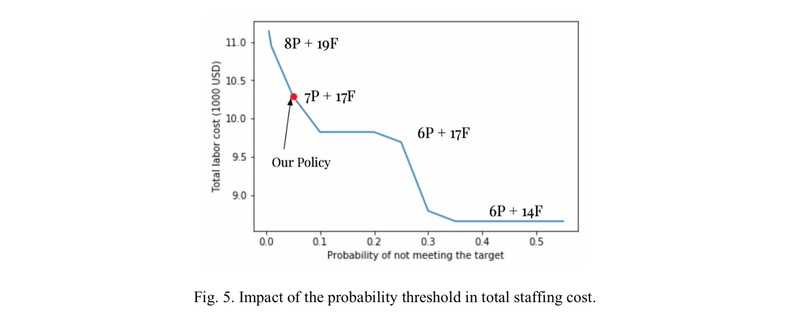
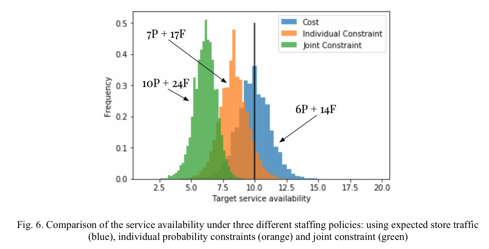

# Stochastic Optimization - Staff Scheduling
Creates a labor schedule for a retailer that minimizes total cost while preserving a given service level target. The schedule is built using Python v. 3.7.1 + Gurobi v. 8.1.1 to solve a Mixed Integer Programming problem with probability constraints.

## Table of Content

* [Background](#Background)
* [Problem Statement](#Problem-Statement)
* [Results](#Results)
* [References](#References)

## Background

Brick-and-mortar retail stores employ about 15% of the American workforce. In retail, variable schedules are the norm where schedules typically change every day and every week with three to seven days’ notice of next week’s schedule. Researchers have found that matching labor to incoming traffic is a key driver of retail profitability. Retailers that have adopted more data-driven approaches for scheduling have been able to capture between 4 and 12 % in cost savings among other facets of store operations.

## Problem Statement

One of the main disadvantages of the current model is that it only takes into account the operational impact of the staffing policy. With an increasing competition and the pressure to create unique experiences in brick-and-mortar stores, retailers depend heavily on the service level they provide to their customers to thrive and survive financially. One indicator they use is the service availability, defined as the number of customers that each staff member can assist. For this retailer, and only as an illustration, we have defined a target of 10. If we use the expected store traffic then we can easily calculate the hourly requirement for staff

E(Nt)/min staff = 10 → min staff = E(Nt)/10

Basically, this is done in the original model, where we obtain an optimal cost of $8,655. This approximation might be reasonable in scenarios where there is not high variability, however if store traffic fluctuates over a long range of values then this approximation is no longer justifiable. We shall then include our service level as probability constraints.

Probability constraints arise naturally in many different applications and there has been an increasing number of research papers that explain how to solve these problems. We have divided the planning horizon (1 week) in 1-hour increments and within each interval we assume the arrival process follows a homogeneous poisson process. 

## Results

*A complete report of this project can be found in the PDF file that is attached to this project.*

We observe that when the probability of meeting the target service is very low (around 0.5) the cost is basically the minimum cost without any probability constraint. As we increase the service level the cost goes up and it can be as high as $11,000 and the team grows from 20 people to 27 people. For our simulations we used p = 0.95 , and the final result is denoted with a red dot. The optimal cost that we obtain is $10,290 which is about 20% larger that the minimum cost obtained using the expected value.

The MIP with individual probability constraints was solved using the p-quantile of the poisson distribution instead of the expected value. For the joint constraint we used a method knows as Scenario Approximation, and it’s similar in nature to the Sample Average Approximation (SAA) that is used to estimate the expected value in the objective function. For a problem of our size we would need at least 86,000 scenarios. 

Figure 6 shows the result of the three different methods. If we use the expected store traffic you would need a team of 20 people and there is a probability of 40% of not meeting the target service availability, but if you use the individual constraints this probability drops to 6% and the team grows to 24 people. Finally, if you use the joint probability constraint, the probability of not meeting the target is 0.001%, however the team grows to 34 people and the staffing cost goes up to $13,395 (+54%). Clearly, the decision of which constraints to add have a great impact in the optimal cost and the decision should be based on market research, strategic analysis, customer insights or from what the competitors are doing. These constraints show clearly the tradeoff of a better service and the staffing costs.

## References
1. Lam, S., Vandenbosch, M., Pearce M. *Retail Sales Force Scheduling Based on Store Traffic Forecasting*. Journal of retailing.
2. Kabak, O., Ulengin, F. et al. *Efficient shift scheduling in the retail sector through two-stage optimization*. European Journal of Operations Research.
3. Williams, J., Lambert, S. et al. *Stable Scheduling Increases Productivity and Sales*. The Stable Scheduling Study.
4. Dentcheva, D. *Optimization Models with Probabilistic Constraints*. Stevens Institute of Technology.
5. Luedtke, J. And Ahmed S. *A Sample Approximation Approach For Optimization With Probabilistic Constraints*. Society for Industrial and Applied Mathematics.
6. András Prékopa. *On Probabilistic Constrained Programming*. Princeton Symposium on Mathematical Programming.
